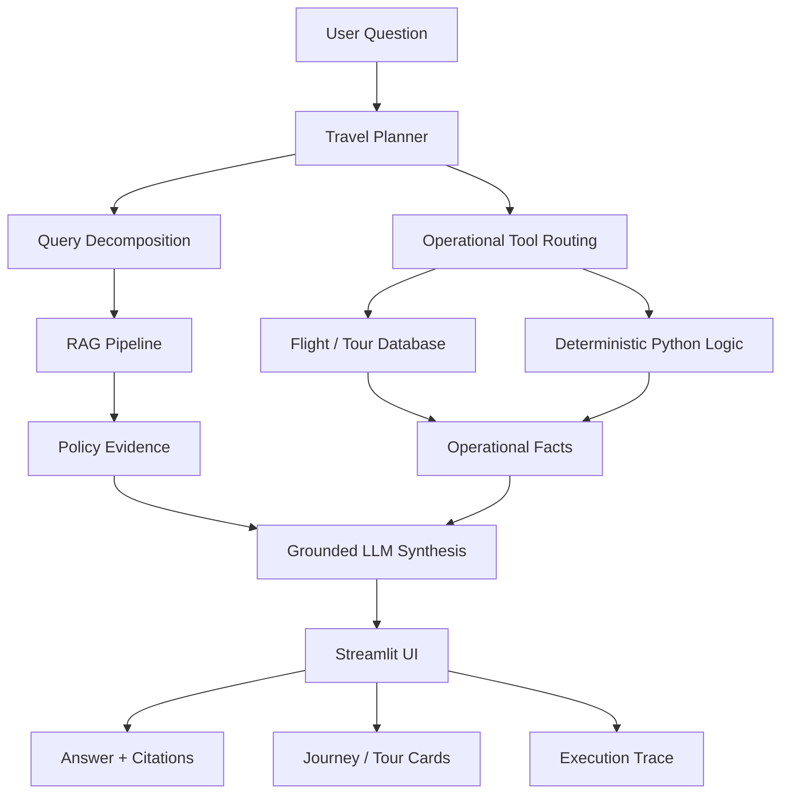
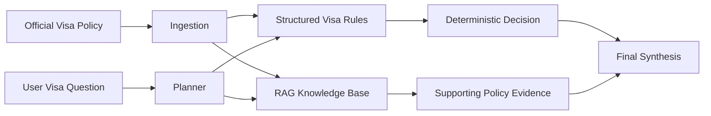

# Travel & Compliance Copilot

An enterprise-style AI assistant for Singapore travel and airport-related questions.

The project is designed around a simple idea:

> Not every user question should be answered by an LLM alone.

Travel and compliance questions often combine **policy knowledge**, **structured operational data**, and **deterministic calculations**. This copilot routes each part of the request to the right tool, then uses an LLM for understanding and final explanation.

---

## Background / Situation

### What is the Free Singapore Tour?

The **Free Singapore Tour (FST)** is an airport transit experience for travellers who have a layover in Singapore and may be able to leave the airport for a short guided tour before their connecting flight.

From a traveller's perspective, the question sounds simple:

> “I have several hours between my flights. Can I join a tour?”

But answering it safely is not a simple FAQ lookup.

The traveller may need to know:

- whether the arrival and departure flights leave enough time;
- which tour sessions fit the actual journey;
- whether seats are still available;
- whether the traveller meets immigration or visa requirements;
- what the participation rules are;
- where to find the official booking or policy information.

These answers come from **different systems and different types of data**.

Policy information may live on airport, immigration, or customs webpages, while flight timing and tour-session availability are operational data. A useful assistant therefore needs to combine both.

---

## Business Pain Points

### 1. Travellers do not think in system boundaries

A traveller does not ask:

> “Please retrieve an immigration policy, then query a flight database, then calculate my transit duration.”

They ask:

> “Can I join the tour?”

To answer that one question, the service may need information from several domains at the same time.

This creates a business challenge: the customer sees **one problem**, while the organisation may have the answer spread across multiple webpages, systems, and operational processes.

---

### 2. Information is fragmented

Relevant information can be distributed across:

- airport and tour webpages;
- immigration / visa guidance;
- customs rules;
- flight records;
- tour schedules and availability;
- internal or operational data.

A traveller or service agent may need to search several sources before reaching a conclusion.

This increases handling effort and creates a higher risk of missing an important condition.

---

### 3. The answer is personalised to the traveller

The correct answer depends on the traveller's own situation.

For example:

```text
Passport / nationality
        +
Arrival flight
        +
Departure flight
        +
Transit duration
        +
Tour schedule
        +
Policy requirements
        ↓
Can this traveller join?
```

A static FAQ can explain the general rules, but it cannot reliably combine all of these inputs into a journey-specific answer.

---

### 4. Policy knowledge and operational data behave differently

Some information changes relatively slowly, such as:

- visa guidance;
- customs rules;
- tour participation requirements.

Other information is operational and can change much more frequently, such as:

- flight timing;
- terminal information;
- tour-session availability;
- remaining capacity.

Putting everything into a single document-based chatbot would make it difficult to distinguish a policy statement from an operational fact.

---

### 5. Compliance answers need to be trustworthy

A wrong answer about a tour description is inconvenient.

A wrong answer about immigration, visa, or customs requirements can be much more serious.

For these topics, the assistant should not simply generate a plausible answer. It should:

- ground policy conclusions in authoritative evidence;
- preserve uncertainty when evidence is incomplete;
- show the supporting source;
- avoid inventing links or policy details.

---

### 6. Traditional RAG is not enough for every question

Some questions are well suited to semantic retrieval:

> “What documents do I need?”

> “Can I bring a drone into Singapore?”

> “What attractions are included in City Sights Tour?”

Other questions are fundamentally structured decisions:

> “Does this passport require a visa?”

> “How long is my transit?”

> “Which tour sessions fit between my two flights?”

These should not depend entirely on whether a vector search happens to retrieve the right paragraph.

The project therefore treats **retrieval, structured data, deterministic logic, and LLM reasoning as different components** rather than forcing every question through the same RAG flow.

---

## Project Goal

The goal of the project is to demonstrate an enterprise-style travel assistant that can turn a fragmented customer journey into one conversational experience.

Instead of asking the traveller to manually combine multiple sources, the copilot:

1. understands the question and traveller context;
2. decomposes compound requests into focused tasks;
3. retrieves relevant policy evidence;
4. queries structured operational data where required;
5. performs deterministic calculations in code;
6. combines the evidence into a concise, cited response;
7. presents operational results such as journey and tour availability in a structured UI.

A representative request is:

> “I’m an Indian passport holder. I arrive on SQ12 on Aug 20 and depart on SQ318 on Aug 20. Which Free Singapore Tours can I join, and do I need a visa?”

Although this looks like one customer question, the system may need to perform several independent checks before producing the final answer.

---

## Technical Pain Points

### 1. Multi-source knowledge must be retrieved consistently

Travel information is not stored in one place.

Typical sources include:

- public government or airport webpages;
- visa and immigration guidance;
- customs rules;
- Free Singapore Tour information;
- internal or operational data;
- structured flight and tour-session records.

The challenge is not only retrieving documents, but deciding **which source should be trusted for which type of question**.

---

### 2. Compound questions require query decomposition

For example:

> “Do I need a visa, can I bring a drone, and which tour can I join?”

This contains at least three knowledge domains:

- visa / immigration;
- customs;
- Free Singapore Tour.

If all topics are sent into one retrieval request, unrelated documents compete for the same Top-K results and important evidence may be pushed out.

---

### 3. Deterministic decisions must stay outside the LLM

Examples:

- calculating transit duration;
- checking flight arrival and departure times;
- checking remaining Free Singapore Tour slots;
- determining whether a tour session fits within a traveller’s journey.

These are operational decisions and should not be calculated by an LLM.

The system therefore separates:

- **LLM** → understanding and explanation;
- **RAG** → policy knowledge;
- **SQL / structured data** → operational facts;
- **Python** → deterministic calculations.

---

### 4. Pure RAG can fail on implicit or negative evidence

A useful example discovered during testing is visa-country lookup.

An official policy page may effectively say:

> “Travellers from the following countries require a visa…”

If `China` is not in that list, the answer depends on reasoning over the **absence of China from the complete set**.

A semantic retriever is good at finding explicit statements such as:

> “Chinese passport holders require…”

but it is much weaker at proving:

> “China is not present anywhere in this visa-required list.”

Chunking makes this even harder because the full country list may be split across multiple chunks.

This is an important limitation of pure RAG for compliance decisions.

---

### 5. Policy eligibility and operational feasibility must remain separate

A Free Singapore Tour may be operationally feasible based on:

- flight timing;
- transit duration;
- session timing;
- session status;
- remaining capacity.

But operational feasibility alone does **not** prove immigration or policy eligibility.

The system keeps these two forms of evidence separate and only combines them during final synthesis.

---

### 6. Follow-up questions require controlled conversation context

Users naturally ask:

> “Tell me more about the second one.”

or:

> “What about the visa?”

The assistant needs enough previous context to resolve these references, but should not automatically repeat every previous intent or rerun every tool.

The conversation layer therefore keeps limited short-term context and gives priority to the current request.

---

### 7. Compliance answers require traceable evidence

For compliance-related answers, returning a fluent answer is not enough.

The system also needs to show:

- what the planner understood;
- which tools were executed;
- what knowledge was retrieved;
- which source supports each policy conclusion;
- which official links came from trusted documents.

---

# Solution

## Hybrid Orchestration Architecture



The architecture intentionally avoids asking one LLM to do everything.

---

## 1. Planner and Query Decomposition

The planner converts natural-language requests into a structured execution plan.

It extracts information such as:

- passport country;
- arrival flight and date;
- departure flight and date;
- knowledge requests;
- required operational lookups;
- missing information.

For a compound question, the planner can generate multiple focused knowledge requests rather than one large retrieval query.

Example:

```text
User:
"I'm an Indian passport holder.
Can I bring a drone into Singapore,
and can I join City Sights Tour?"

Planner:

1. Visa knowledge request
2. Customs knowledge request
3. FST knowledge request
```

This keeps retrieval focused and prevents unrelated topics from competing for the same retrieval budget.

---

## 2. Retrieval-Augmented Generation

Policy questions are sent to a dedicated RAG pipeline.

The current AI stack includes:

- BGE embeddings;
- Chroma vector store;
- BM25 lexical retrieval;
- parent-document storage;
- reranking;
- Claude-based final synthesis.

Each decomposed knowledge request is retrieved independently.

```text
visa query
    ↓
independent retrieval

customs query
    ↓
independent retrieval

FST query
    ↓
independent retrieval
```

The retrieved evidence is grouped by topic before being passed to the final response layer.

---

## 3. Evidence-First Answer Generation

Retrieved documents are stored as structured evidence objects.

Each evidence item can carry:

- document title;
- source;
- heading;
- page;
- content;
- rerank score;
- trusted source URL.

Before final synthesis, Python assigns controlled citation IDs such as:

```text
[VISA1]
[FST1]
[CUSTOMS1]
```

The LLM is instructed to use only the supplied evidence and operational facts.

It is explicitly told:

- not to use outside knowledge;
- not to invent URLs;
- not to override deterministic results;
- to preserve uncertainty;
- to cite policy conclusions;
- to state when the supplied evidence is incomplete.

This makes the final answer easier to audit and debug.

---

## 4. Structured Operational Data

Operational questions are routed away from RAG.

Examples include:

- flight lookup;
- arrival / departure terminal;
- estimated or scheduled time;
- tour-session availability;
- remaining slots.

These values come from structured repositories rather than the LLM.

---

## 5. Deterministic Calculations

Calculations such as transit duration are performed in Python.

```text
Arrival time
     +
Departure time
     ↓
Deterministic transit calculation
     ↓
Transit duration
```

This avoids asking the LLM to perform calculations that can be executed reliably in code.

---

## 6. Free Singapore Tour Eligibility

The FST flow combines several components:

```text
Arrival flight
      ↓
Departure flight
      ↓
Transit duration
      ↓
Tour session timing
      ↓
Operational availability
      ↓
Feasible sessions
```

The detailed tour sessions are displayed as structured UI cards containing:

- tour name;
- date;
- time;
- remaining slots;
- booking action.

The LLM receives the same operational facts for grounding but is instructed not to duplicate the entire session table in prose.

---

## 7. Conversation-Aware Follow-Ups

The Streamlit application stores recent conversation turns and provides limited context to the planner and final synthesis layer.

Previous conversation is treated as **context, not authoritative policy evidence**.

This enables follow-ups such as:

```text
User:
"Which tours can I join?"

Assistant:
...

User:
"Tell me more about the second one."
```

while keeping the current question as the primary intent.

---

## 8. Transparent Execution Trace

The UI includes an expandable:

> **How did the copilot answer this?**

section.

It exposes the major execution stages:

- planner output;
- flight database lookup;
- deterministic transit calculation;
- FST feasibility check;
- knowledge retrieval;
- final synthesis.

This is useful for debugging and demonstrates how the answer was constructed.

---

# Key Design Decision: RAG vs Deterministic Rules

One of the most important lessons from the project is that **RAG should not be used for every type of decision**.

### Good RAG use cases

```text
"What documents do I need for a Singapore visa?"
"How does VFTF work?"
"Can I bring a drone into Singapore?"
"What attractions are included in City Sights Tour?"
```

These questions require retrieving and explaining policy text.

### Better handled as structured rules

```text
"Does passport country X require a visa?"
"How long is my transit?"
"Which tour sessions fit my journey?"
```

These questions depend on structured data, set membership, or deterministic calculations.

For example, a visa-required country list is better represented as structured policy data than as text chunks alone.

A future enterprise implementation can therefore extend the architecture with a structured visa-policy repository:



This allows the system to use:

- structured rules for the decision;
- RAG for explanation and supporting evidence;
- the LLM for natural-language synthesis.

---

# Example Use Cases

### Visa + FST

```text
I'm an Indian passport holder.
I arrive on SQ12 on Aug 20
and depart on SQ318 on Aug 20.
Which Free Singapore Tours can I join,
and do I need a visa?
```

Demonstrates:

- entity extraction;
- query decomposition;
- visa retrieval;
- flight lookup;
- transit calculation;
- FST feasibility;
- grounded synthesis.

### Customs

```text
Can I bring a drone into Singapore?
```

Demonstrates:

- focused customs retrieval;
- evidence grounding;
- source citation.

### Tour Information

```text
Give me more detail about City Sights Tour.
```

Demonstrates:

- FST knowledge retrieval;
- policy / itinerary explanation;
- no unnecessary operational lookup.

---

# Current Tech Stack

| Layer | Implementation |
|---|---|
| Frontend | Streamlit |
| LLM | Claude via `langchain-anthropic` |
| Planner | Structured-output LLM |
| Vector retrieval | Chroma |
| Embeddings | BGE |
| Lexical retrieval | BM25 |
| Reranking | Reranker stage |
| Operational data | Structured database / repositories |
| Deterministic logic | Python |
| Validation | Pydantic |
| Conversation state | Streamlit Session State |

---

# Project Principles

1. **Use the LLM for language, not everything.**
2. **Keep policy knowledge separate from operational facts.**
3. **Use deterministic code when the answer can be calculated.**
4. **Decompose compound questions before retrieval.**
5. **Ground policy claims in retrieved evidence.**
6. **Never let conversation history become an authoritative source.**
7. **Preserve uncertainty instead of forcing an answer.**
8. **Make the execution path visible and debuggable.**

---

# Known Limitations / Next Improvements

The current implementation is a working demonstration rather than a production deployment.

The main next improvements are:

- move decision-bearing visa rules into structured policy data;
- build a golden evaluation dataset for planner, retrieval and answer accuracy;
- add automated citation validation;
- add source-version and policy-effective-date controls;
- add monitoring for retrieval failures and unsupported answers.

---
