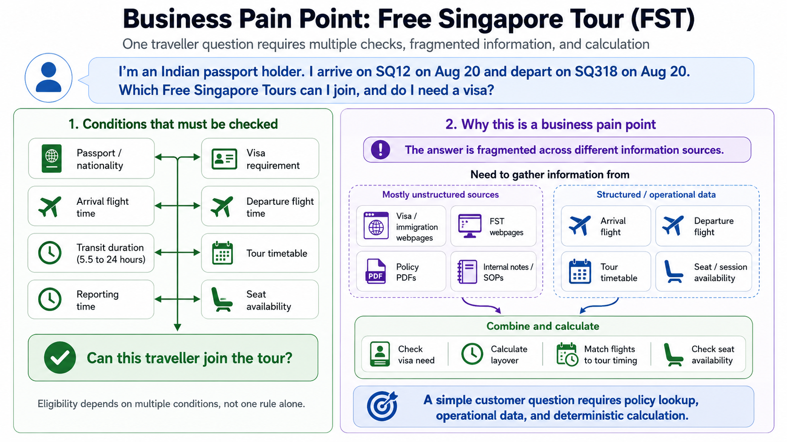
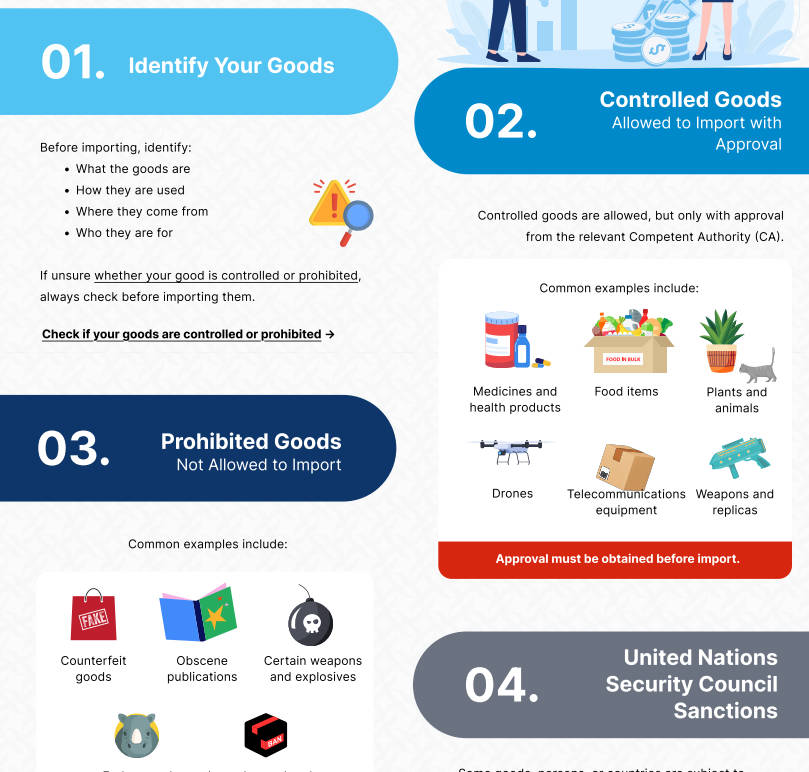
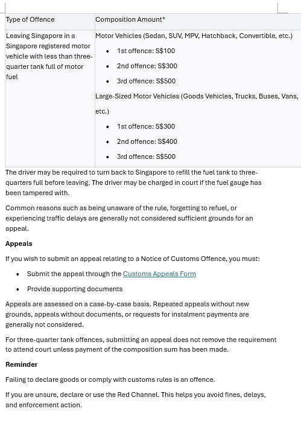
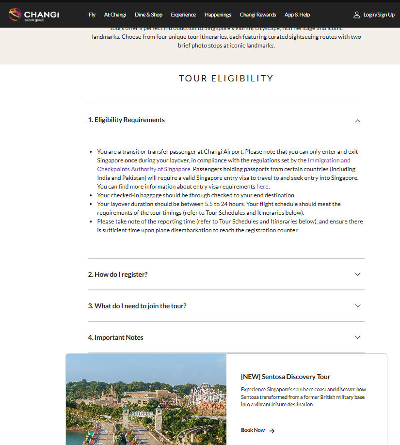
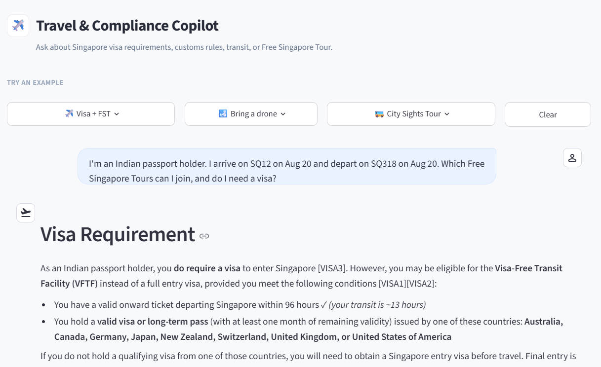
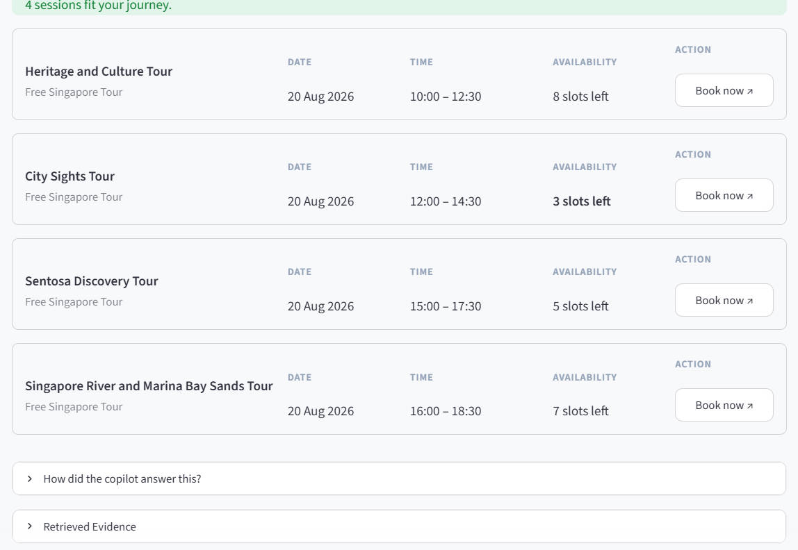
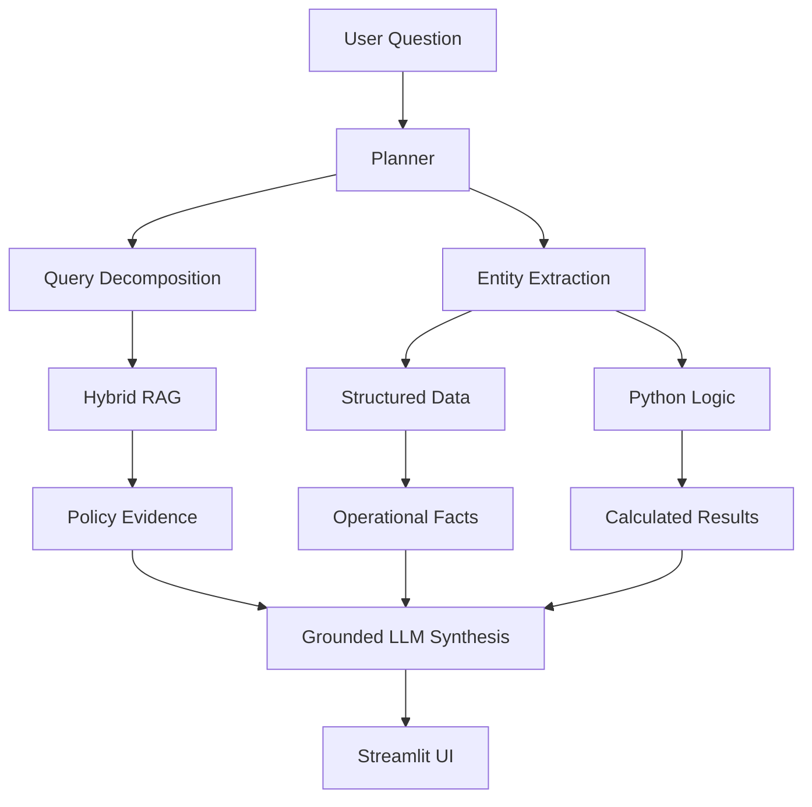
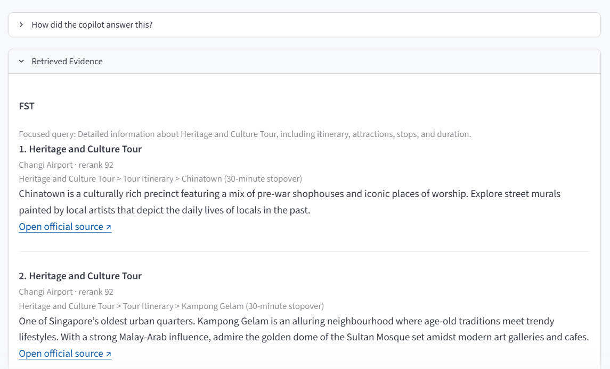

# Travel & Compliance Copilot

An enterprise-style AI assistant for Singapore travel and airport-related questions.

The project is built around one core principle:

> **Not every user question should be answered by an LLM alone.**

Travel and compliance questions often combine policy knowledge, structured operational data, and deterministic calculations.

Instead of forcing every request through a single RAG pipeline, the copilot routes different parts of the question to the most appropriate component:

- **LLM** for understanding and natural-language synthesis
- **RAG** for policy and knowledge retrieval
- **Structured data** for operational facts
- **Python** for deterministic calculations and business rules

---

## 1. Business Problem



A traveller may ask one simple question:

> **“Can I join the Free Singapore Tour?”**

But answering it can require multiple types of information:

| Question | Source / Method |
|---|---|
| Does this passport require a visa? | Immigration policy |
| What time does the flight arrive or depart? | Structured flight data |
| How long is the layover? | Deterministic calculation |
| Which tour sessions are available? | Structured tour schedule |
| Is the passenger eligible to join? | Policy + operational rules |

The information is fragmented across policy webpages, operational systems, and structured records.

A traditional chatbot is not enough because different information requires different handling.

---

## 2. Demo

### Multi-Source Data Handling
The copilot combines unstructured knowledge sources with structured operational data.

<table>
<tr>

<td width="25%" align="center">

<b>PDF Policy</b><br><br>



<br>
Headings · paragraphs · infographics

</td>

<td width="25%" align="center">

<b>Word SOP</b><br><br>



<br>
Procedures · numbered steps · links

</td>

<td width="25%" align="center">

<b>Web Content</b><br><br>



<br>
FAQ · accordion · nested headings · pictures

</td>

<td width="25%" align="center">

<b>Operational Database</b><br><br>


<br>
Flights · tour sessions · availability

</td>

</tr>
</table>
PDF, Word and web content are processed through the RAG pipeline for policy and procedural knowledge.

Flight schedules and Free Singapore Tour sessions are stored in SQLite and queried directly as structured operational data.

### Example Request
Example request:

> **“I’m an Indian passport holder. I arrive on SQ12 on Aug 20 and depart on SQ318 on Aug 20. Which Free Singapore Tours can I join, and do I need a visa?”**

The copilot automatically:

1. extracts passport and flight information;
2. retrieves relevant visa and tour policy;
3. looks up flight information;
4. calculates transit duration;
5. checks operationally feasible tour sessions;
6. generates a grounded answer with citations.

The UI also exposes an explanation panel:

> **How did the copilot answer this?**

```text
Planner
↓
Flight Lookup
↓
Transit Calculation
↓
Tour Availability
↓
Policy Retrieval
↓
Final Answer
```

This makes the execution path visible instead of hiding all reasoning behind a single chat response.

<p align="center">
  
</p>

<p align="center">
  <em>Figure 1. End-to-end demo combining visa policy retrieval, flight lookup, transit calculation, and tour availability.</em>
</p>

<p align="center">
  
</p>

<p align="center">
  <em>Figure 2. Structured tour recommendations based on flight timing and operational availability.</em>
</p>

---

## 3. System Architecture



The planner decides which execution path is required for each part of the question.
Each component has a narrow responsibility:

- **Planner** — understands intent, extracts entities, and decomposes compound questions.
- **RAG pipeline** — retrieves policy evidence using hybrid search and reranking.
- **Structured-data tools** — retrieve operational facts such as flight and tour information.
- **Python logic** — performs deterministic calculations and rule-based checks.
- **Final synthesizer** — combines evidence and calculated results into one grounded response.

Only the final synthesis layer draws a natural-language conclusion.

---

## 4. Key Technical Decisions

### 4.1 Query decomposition before retrieval

Compound questions are split into focused topics before retrieval.

For example:

```text
"Which Free Singapore Tours can I join,
and do I need a visa?"
```

can be decomposed into separate retrieval and execution tasks:

```text
1. Singapore visa requirement for the passport holder
2. Free Singapore Tour immigration eligibility
3. Flight arrival / departure lookup
4. Transit duration calculation
5. Tour-session feasibility
```

This prevents unrelated documents from competing for the same Top-K retrieval slots.

### 4.2 RAG vs deterministic logic

Different problem types are handled by different components:

| Problem | Approach |
|---|---|
| Policy explanation | RAG |
| Exact operational facts | Structured data |
| Transit calculation | Python |
| Tour feasibility | Python + structured data |
| Natural-language explanation | LLM |

The key idea is to avoid using an LLM where a deterministic system can produce a more reliable answer.

### 4.3 Hybrid retrieval

The retrieval pipeline combines lexical and semantic search:

```text
BM25 Search       Vector Search
      \              /
       \            /
        Score Fusion
             ↓
          Reranker
             ↓
       Best Evidence
```

- **BM25** is useful for exact policy terminology, identifiers, and named entities.
- **Vector search** is useful when the user phrases a question differently from the source document.
- **Reranking** prioritises the passages most relevant to the complete sub-question.

### 4.4 Compliance answers require traceable evidence

Retrieved evidence is assigned controlled citation IDs before being passed to the LLM.

```text
[VISA1]
[FST1]
[CUSTOMS1]
```

The final answer can then reference the evidence that supports each policy claim.

This improves traceability and reduces unsupported answers.
<p align="center">
  
</p>

<p align="center">
  <em>Figure 3. Grounded policy response with traceable source citations.</em>
</p>

### 4.5 Conversation history is context, not evidence

Previous messages help the system understand follow-up questions and resolve references.

However, conversation history is not treated as authoritative policy evidence.

Policy conclusions must still come from trusted retrieved sources.

This prevents an earlier answer from silently overriding newer or more authoritative policy information.

### 4.6 Pure RAG can fail on implicit or negative evidence

A limitation discovered during testing was reasoning over complete policy lists.

For example, an official page may state:

> “Travellers from the following countries require a visa…”

Determining that a country **does not appear** in the list is fundamentally different from retrieving an explicit statement about that country.

Semantic retrieval works well when supporting evidence is explicit:

> “Passport holders from Country X require a visa.”

It is less reliable when the answer depends on proving the absence of an item from a complete set.

Chunking makes this harder because a long country list may be distributed across several chunks.

For these cases, the system should prefer structured policy data or deterministic membership checks instead of relying only on semantic retrieval.

---

## 5. Example Execution

For the example query:

> **“I’m an Indian passport holder. I arrive on SQ12 on Aug 20 and depart on SQ318 on Aug 20. Which Free Singapore Tours can I join, and do I need a visa?”**

The planner may produce an execution plan similar to:

```json
{
  "passport_country": "India",
  "arrival_flight": "SQ12",
  "departure_flight": "SQ318",
  "knowledge_queries": [
    "Singapore visa requirements for Indian passport holders",
    "Free Singapore Tour immigration eligibility"
  ],
  "requires_flight_lookup": true,
  "requires_transit_calculation": true,
  "requires_tour_availability_check": true
}
```

The system then executes independent retrieval and deterministic steps before generating the final response.

```text
User Question
    ↓
Planner
    ↓
 ┌──────────────────────────────────────┐
 │                                      │
 ▼                                      ▼
Policy Retrieval                 Operational Execution
 │                               │
 ▼                               ├─ Flight lookup
Hybrid Retrieval                 ├─ Transit calculation
 │                               └─ Tour availability
 ▼                                      │
Evidence                                ▼
 │                               Operational Facts
 └────────────────┬─────────────────────┘
                  ▼
           Final Synthesis
                  ↓
      Grounded Answer + Citations
```

---

## 7. Design Principles

1. **Use LLMs for interpretation, not arithmetic.**
2. **Retrieve policy; query operational facts.**
3. **Separate evidence collection from answer generation.**
4. **Treat conversation history as context, not authority.**
5. **Prefer deterministic checks when completeness or exactness matters.**
6. **Expose execution traces so answers are easier to inspect and debug.**

---

## 8. Tech Stack

| Layer | Technology |
|---|---|
| UI | Streamlit |
| Orchestration | LangChain |
| LLM | Claude |
| Planning | Structured-output LLM |
| Embeddings | BGE |
| Vector Store | Chroma |
| Lexical Retrieval | BM25 |
| Ranking | Reranker |
| Structured Data | SQLite |
| Business Logic | Python |
| Validation | Pydantic |

---

## 9. Key Takeaway

This project is not simply a RAG chatbot.

It demonstrates how to decide:

- **when to use an LLM;**
- **when to use retrieval;**
- **when to query structured systems;**
- **when deterministic logic is more reliable.**

The main architectural goal is not to make the LLM do more.

It is to make the overall system **more grounded, traceable, and reliable by giving each component the job it is best suited for.**
